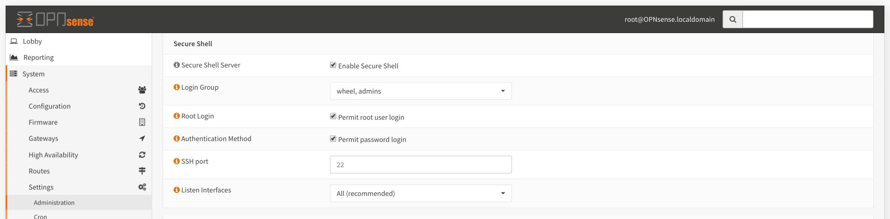

# Prepare Your Firewall

To install Sensei on your open source firewall, you need to connect to it via `ssh` with `root` privileges.


Sensei is created to run on open source firewalls like OPNsense. This documentation based on OPNsense 18.1.x/18.7.x branches.


1. Login to your OPNsense firewall's dashboard
2. Head to the System &gt; Settings &gt; Administrations menu
3. Enable all three checkboxes 

