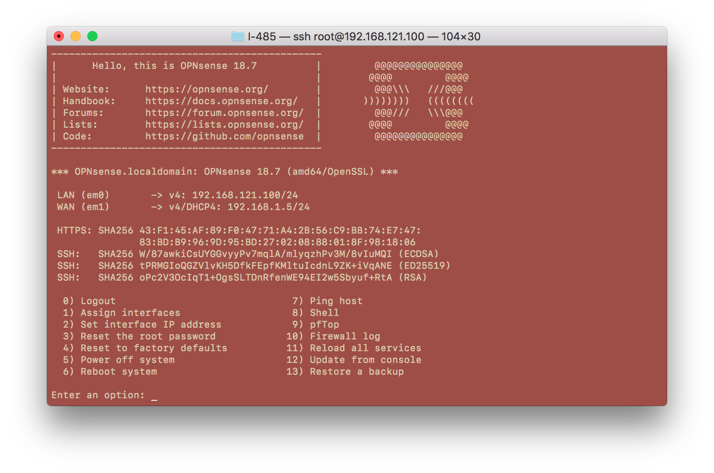
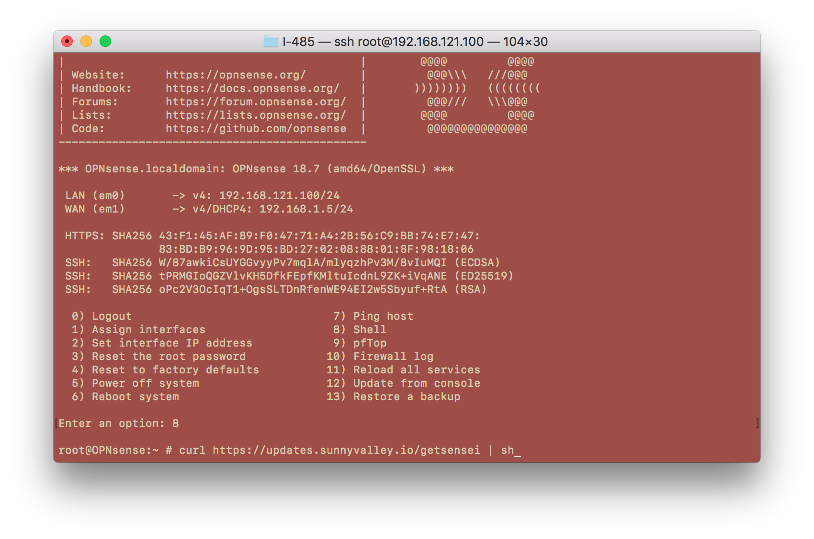
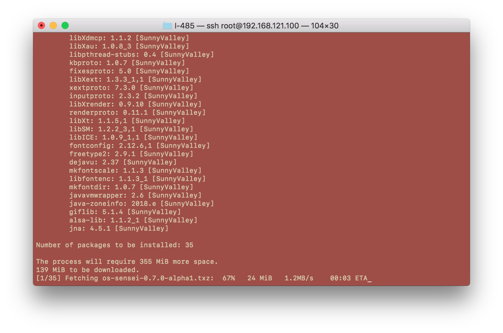
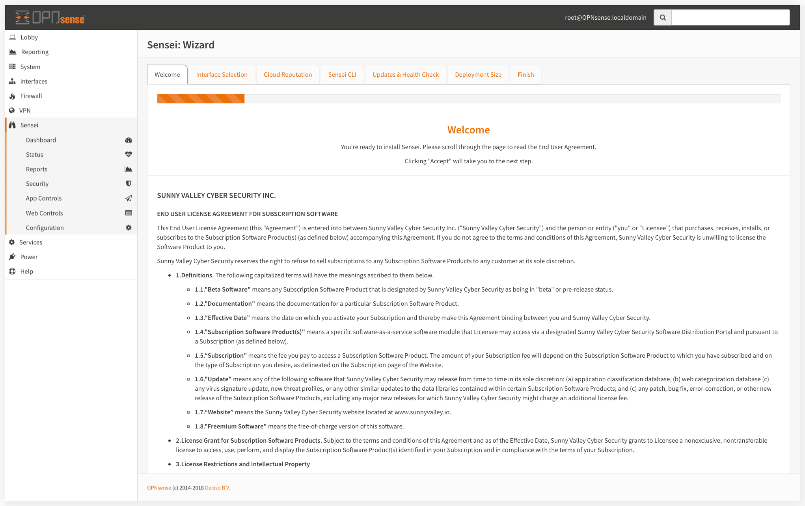
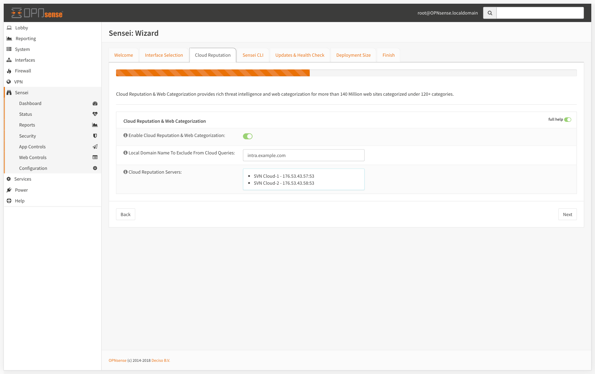
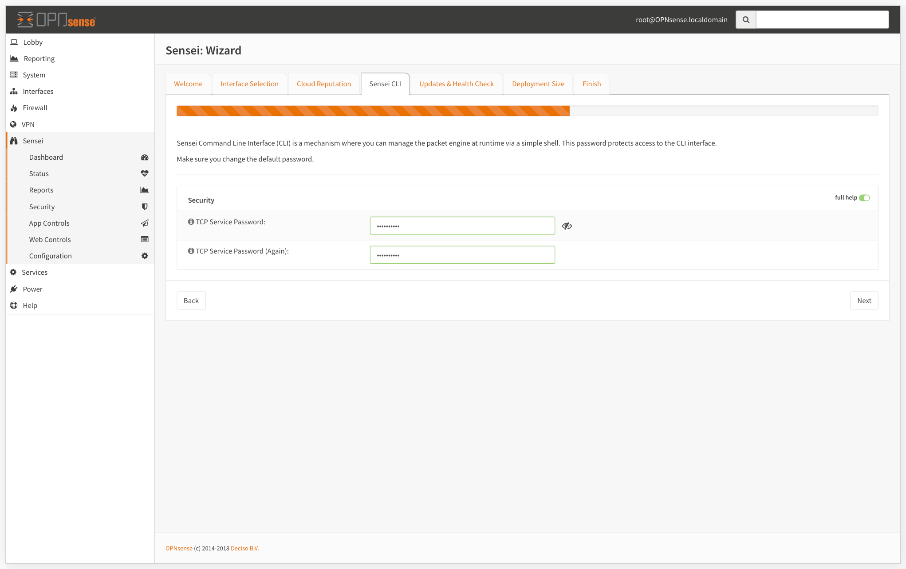

# Installing Sensei

This process is quite straight-forward and easy. You download an installer file onto the firewall and run it. Everything then gets taken care by the installer script.


Sensei Community Edition is free-of-charge. You can download your copy from [https://www.sunnyvalley.io/sensei](https://www.sunnyvalley.io/sensei)  


## Connect to Your Firewall

```text
$ ssh root@your-firewall-ip
```

After a successful login, enter "8" as the option to drop to the shell



## Download & Run Sensei Installer

Once you register your copy at [https://www.sunnyvalley.io/sensei](https://www.sunnyvalley.io/sensei), you'll be provided with a download URL to setup latest community edition. 

```text
root@fw:~ # curl https://updates.sunnyvalley.io/getsensei | sh
```



Hence we passed downloaded scripto `sh` , it will automatically run setup script.

```text
Installing via OPNsense installer
Do you wish to install Sensei? y
```

Depending on your computer setup and your internet connection speed, it might take 2-4 minutes to complete.



Once the install completed, you can disconnect from your terminal, and disable your firewall's ssh service by unchecking the checkbox mentioned above.

## Initial Configuration Wizard


To start using Sensei, first, you need to go through the Wizard which will guide you to start with the best initial configuration.


To start your "Initial Configuration Wizard"; 

* Login to your OPNsense Web UI
* Click Sensei from the left menu.
* Click on the Dashboard sub-menu. It will open up the Wizard.

### 1- EULA

* Accept the End User Agreement \(Scroll & read the terms to get to next button\).
* Click "Next" and get to the "Interface Selection" section.



### 2- Interface Selection

* Select the Ethernet Interfaces to protect. To do that, click on an interface and use the right/left arrow buttons to move it to protected/unprotected interfaces combo box.
* Click "Next" and get to the "Security" section.


### 3- Cloud Reputation

The Cloud Threat Intelligence data is queried real time when anyone makes a connection through your network. This enables us to respond to malware and wireless outbreaks in real time and very fast.

The engine process the request, queries "SVN Cloud" in realtime, and decides whether it will be blocked or allowed. We check against 140+ Million Websites, under 120+ categories in milliseconds.

Cloud Threat Intel settings lets you;

* Enable/Disable the cloud reputation and web categorization
* Set local domain settings to be excluded from cloud queries



### 4- Sensei CLI \(Security\)

* Set your TCP Service password. This password protects the command line based CLI access to the packet engine. It is highly recommended to set this with a secure one.
* Click "Next" and get to the "Updates" .



### 4- Updates & Health Check

* Sensei uses OPNsense package system to deliver its updates. Configure the way you receive your Sensei updates as you feel convenient.



Hands-on video: [https://www.youtube.com/watch?time\_continue=7&v=y6OE2FuzkF0](https://www.youtube.com/watch?time_continue=7&v=y6OE2FuzkF0)


