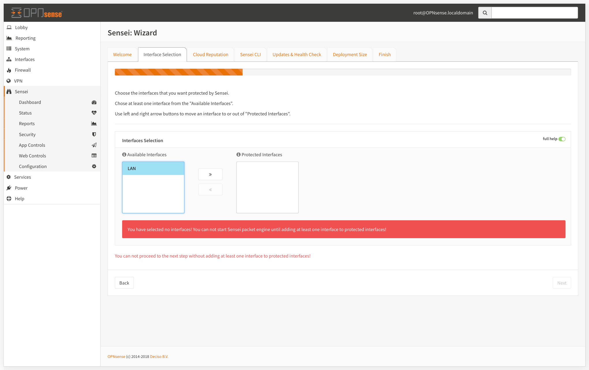

# Installing Sensei

This process is quite straight-forward and easy. You download an installer file onto the firewall and run it. Everything then gets taken care by the installer script.


Sensei Community Edition is free-of-charge. You can download your copy from [https://www.sunnyvalley.io/sensei](https://www.sunnyvalley.io/sensei)  


## Connect to Your Firewall

```text
$ ssh root@your-firewall-ip
```

After a successful login, enter "8" as the option to drop to the shell


## Download & Run Sensei Installer

Once you register your copy at [https://www.sunnyvalley.io/sensei](https://www.sunnyvalley.io/sensei), you'll be provided with a download URL to install the latest community edition.

```text
root@fw:~ # curl https://updates.sunnyvalley.io/getsensei | sh
```


Hence we passed the downloaded script to `sh`, it will automatically run the setup script.

```text
Installing via OPNsense installer
Do you wish to install Sensei? y
```

Depending on your computer setup and your internet connection speed, it might take 2-4 minutes to complete.


You can get detailed info about suggested hardware on [Getting Started &gt; Hardware Requirements​](getting-ready.md).



Once the install completed, you can disconnect from your terminal, and disable your firewall's ssh service by unchecking the checkboxes mentioned above.

## Initial Configuration Wizard


To start using Sensei, first, you need to go through the Wizard which will guide you to start with the best initial configuration.


To start your "Initial Configuration Wizard"; 

* Log in to your OPNsense Web UI,
* Click Sensei from the left menu,
* Click on the Dashboard sub-menu. It will open up the Wizard.

### 1- EULA

* Accept the End User License Agreement \(Scroll & read the terms to get to the next button\).
* Click "Next" and get to the "Interface Selection" section.


### 2- Interface Selection

* Select the Ethernet Interfaces to protect. To do that, click on an interface and use the right/left arrow buttons to move it to protected/unprotected interfaces combo box.
* Click "Next" and get to the "Security" section.



### 3- Cloud Reputation

The Cloud Threat Intelligence data is queried real time when anyone makes a connection through your network. It enables us to respond to malware and wireless outbreaks in real time and very fast.

The engine processes the request, queries to "SVN Cloud" in real-time and decides whether it will be blocked or allowed. We check against 140+ Million Websites, under 120+ categories in milliseconds.

Cloud Threat Intel settings let you;

* Enable/Disable the cloud reputation & web categorization engine
* Set local domain settings to be excluded from cloud queries


### 4- Sensei CLI \(Security\)

* Set your TCP Service password. This password protects the command line based CLI access to the packet engine. It is highly recommended to set this with a secure one.
* Click "Next" and get to the "Updates" .


### 5- Updates & Health Check


Sensei uses OPNsense package system to deliver its updates. Configure the way you receive your Sensei updates as you feel convenient.


* **Self Health Check:** If enabled "Self Health Check" monitors the system's memory, CPU, disk usage and core services if they're working correctly, and raises alerts \(still in development\) if anything goes wrong. The Check also stops the relevant services if they're consuming excessive system resources.
* **Check for Updates Automatically:** Checks automatically for the updates and creates a notification on the status page.
* **Update Databases and Threat Intelligence Data Automatically:** Checks automatically for the updates and creates a notification on the status page .
* **Enable Generation of Suppport Data:** Sensei collects supporting data during unusual events and crashes  if enabled. You can share this data when opening a ticket with us. 


### 6- Deployment Size

Sensei supports up to 1000 concurrent users on an everyday PC. You can set your Sensei installation's capacity here.


You can get detailed info about suggested hardware on [Getting Started &gt; Hardware Requirements​](getting-ready.md)



### 7- Finish

Click the Finish button to save your initial configuration data and start using Sensei.


## Hands-on Video


Hands-on video: [https://www.youtube.com/watch?time\_continue=7&v=y6OE2FuzkF0](https://www.youtube.com/watch?time_continue=7&v=y6OE2FuzkF0)


{% embed data="{\"url\":\"https://www.youtube.com/watch?time\_continue=7&v=y6OE2FuzkF0​\",\"type\":\"video\",\"title\":\"Installing Sensei next generation add-on onto OPNsense\",\"description\":\"Download free community edition:  https://www.sunnyvalley.io/sensei\\n\\nThis video illustrates how you can install Sensei on OPNsense open source firewall. \\n\\nSensei extends the capabilities of OPNsense with next generation firewalling features like Application Filtering & Control, TLS Inspection, Advanced Network Analytics and many more.\",\"icon\":{\"type\":\"icon\",\"url\":\"https://www.youtube.com/yts/img/favicon\_144-vfliLAfaB.png\",\"width\":144,\"height\":144,\"aspectRatio\":1},\"thumbnail\":{\"type\":\"thumbnail\",\"url\":\"https://i.ytimg.com/vi/y6OE2FuzkF0/maxresdefault.jpg\",\"width\":1280,\"height\":720,\"aspectRatio\":0.5625},\"embed\":{\"type\":\"player\",\"url\":\"https://www.youtube.com/embed/y6OE2FuzkF0?rel=0&showinfo=0\",\"html\":\"<div style=\\\"left: 0; width: 100%; height: 0; position: relative; padding-bottom: 56.2493%;\\\"><iframe src=\\\"https://www.youtube.com/embed/y6OE2FuzkF0?rel=0&amp;showinfo=0\\\" style=\\\"border: 0; top: 0; left: 0; width: 100%; height: 100%; position: absolute;\\\" allowfullscreen scrolling=\\\"no\\\"></iframe></div>\",\"aspectRatio\":1.7778}}" %}

