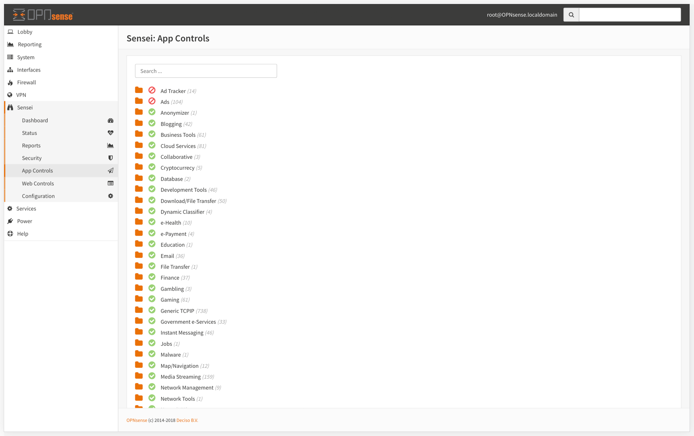

# Application Control

Sensei's Application Control engine works seamlessly behind the scenes when a user requests to connect through your network and process the request, uses "App DB" to decide whether it will be blocked or allowed.


"APP DB" is maintained by Sunny Valley Networks. You can update it through [Status &gt; App DB Update & Reload](status.md#app-db-update-and-reload)


## Categorization

Applications are categorized by their type, and listed in a click-to-open treeview for a convenient access. 

## Dynamic Search

You can use dynamic search on top of the category list to filter out the items. We search as you type.

## Blocking an Application or a Category

### Blocking an application 

Sensei allows you to block individual applications by clicking on the green check icons located on the left side of each application.

### Blockin an entire category

You can also block entire category by clicking the green check icon located on the left side of the category name.

### Activating the rules

When you're ok with the changes you made, click on the button lower right corner of the screen to save and activate the rules.

### Testing the results

The rules goes in the action immediately after you hit the save button. The request silently blackholed on the user's end.

