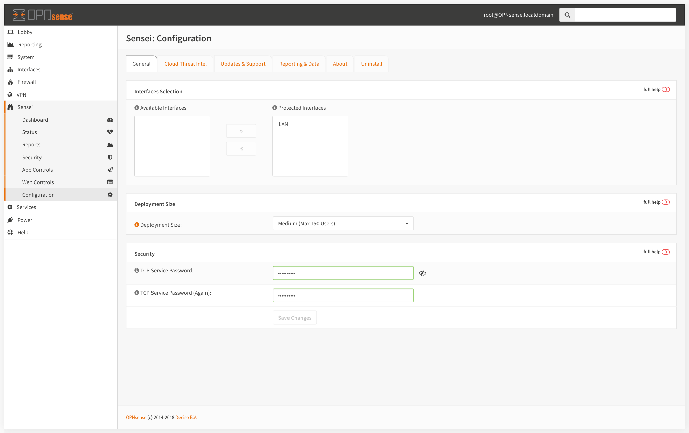
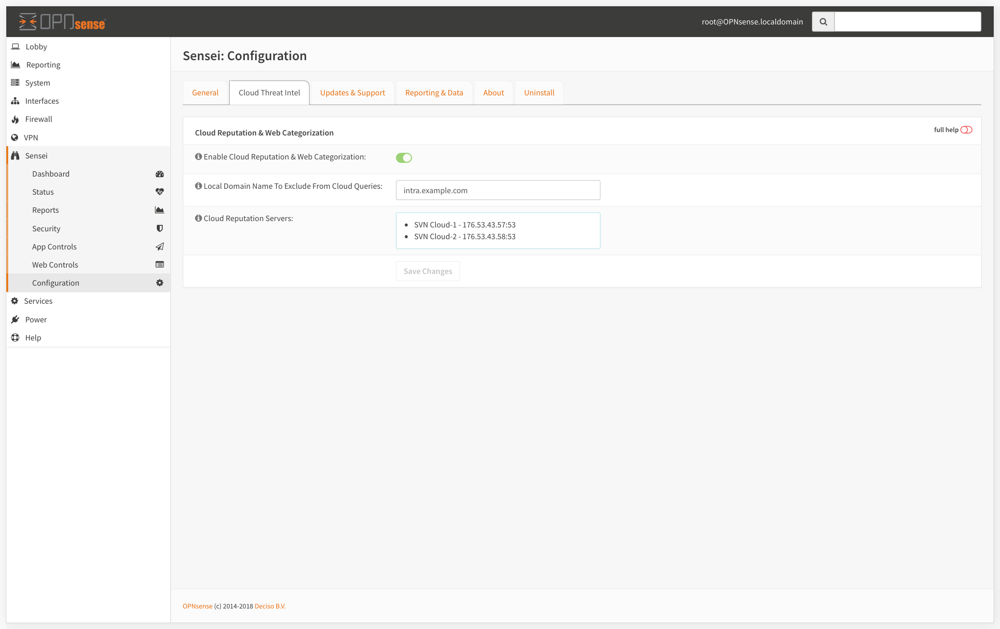
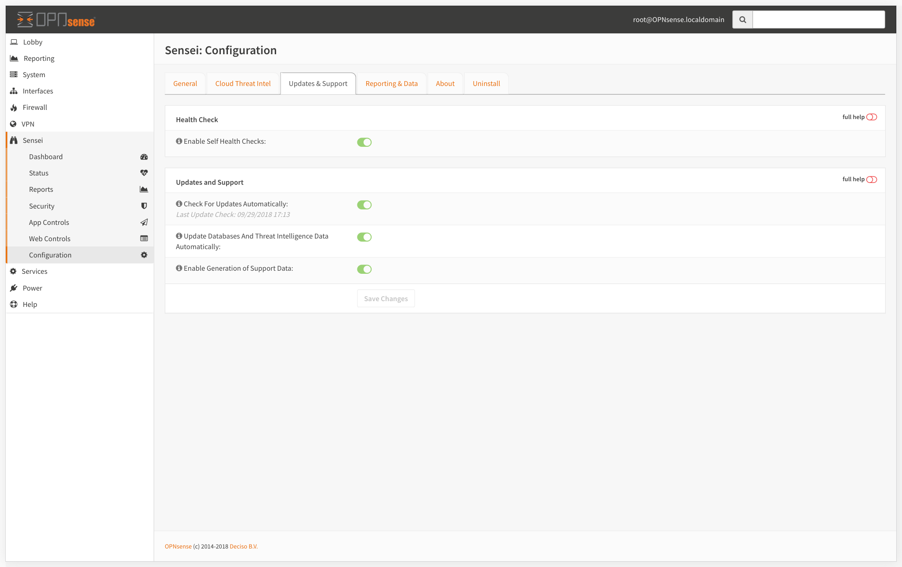
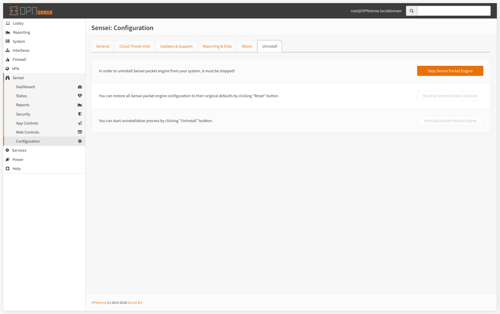

# Configuration

## General

### Interface Selection

* Select the Ethernet Interfaces to protect. To do that, click on an interface and use the right/left arrow buttons to move it to protected/unprotected interfaces combo box.

### Deployment Size

Sensei supports upto 1000 concurrent users on a everyday PC. You can set your Sensei installation's capacity here. 


You can get detailed info about suggested hardware on [Getting Started &gt; Hardware Requirements](../getting-started/getting-ready.md)


### Security

* Set your TCP Service password. This password protects the command line based CLI access to the packet engine. It is highly recommended to set this with a secure one.

## Cloud Threat Intel

The Cloud Threat Intelligence data is queried real time when anyone makes a connection through your network. This enables us to respond to malware and wireless outbreaks in real time and very fast.

The engine process the request, queries "SVN Cloud" in realtime, and decides whether it will be blocked or allowed. We check against 140+ Million Websites, under 120+ categories in milliseconds.

Cloud Threat Intel settings lets you;

* Enable/Disable the cloud reputation and web categorization
* Set local domain settings to be excluded from cloud queries

## Updates & Support

* **Self Health Check:** If enabled "Self Health Check" monitors the system's memory, cpu, disk usage and core services if they're working properly, and raises alerts \(still in development\) if anything goes wrong. The Check also stops the relavant services if they're consuming excessive system resources.
* **Check for Updates Automatically:** Checks automattically for the updates and updates silently.
* **Update Databases and Threat Intelligence Data Automatically:** Checks automattically for the updates and updates silently.
* **Enable Generation of Suppport Data:** Sensei collects supporting data during unusual events and crashes locally if enabled. You can share this data when opening a ticket with us. 

## Reporting & Data

### Reports Data Retiring

As of Sensei 0.7, we retire reports data to open up space for the new data. Data retention works every number of days you set.

### Scheduled Reports

Sensei sends Daily Executive Summary emails every day when enabled. To enabled this you need to set your email server connection settings.

## About

On "About" screen, you can get overall info about your license, Sensei versions, connections to necessary links to our support portal, as well as the user's manual. 

## Uninstall

In order to uninstall Sensei packet engine, it must be stopped first. You can either reset Sensei to its factory defaults or uninstall it.

