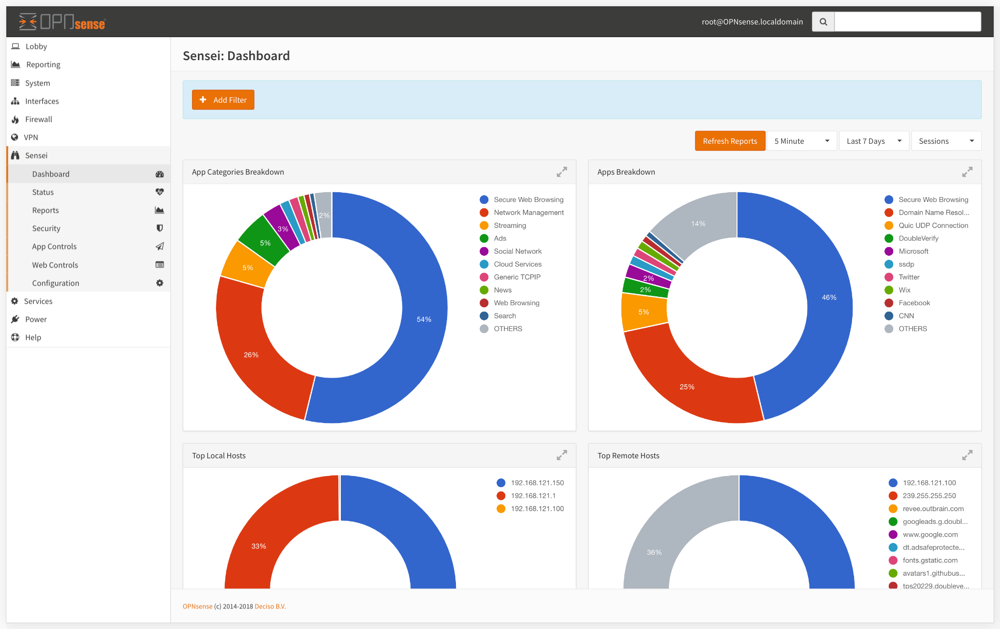

# Dashboard

Sensei Dashboard gives you a quick glimpse of all modules. Most critical information gathered by Sensei is displayed here.


During Sensei's development, we did our best to use everyday plain English and explicit texts on the UI. If you're familiar with your home router's management user interface, you may feel home :\)


