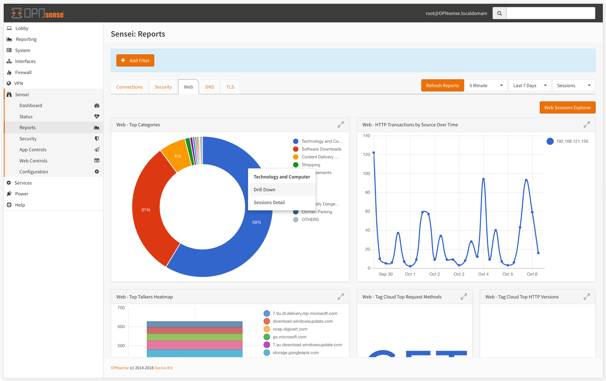
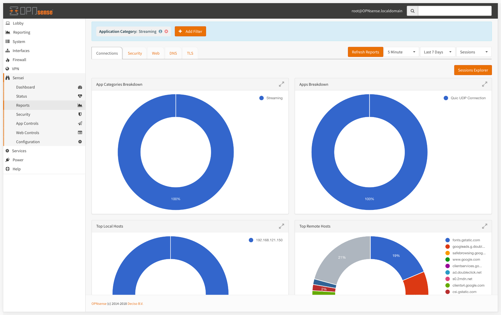
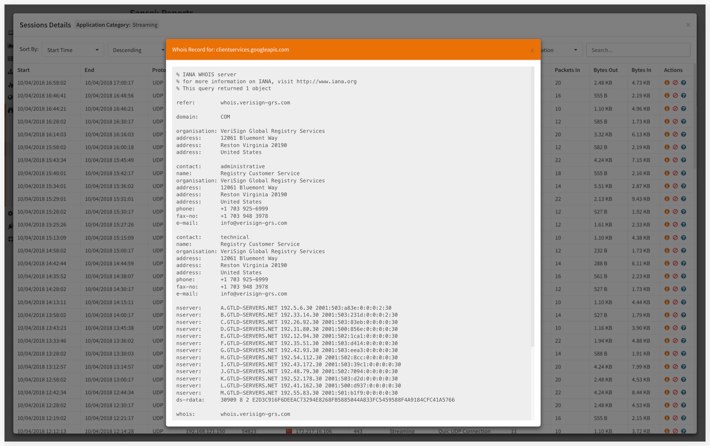

# Reports

Reports module is the place where you see what is happening on your network, which rules are hitting and more in real-time.


All reports have their charts set up. You'll be provided with the charts relevant to the report you're on.


## Start with the big picture, drill-down to details

Sensei's rich reporting allows you both to see the overall network activity in a birds-eye view, and if you want to inspect in detail, you can select any chart item and drill-down to details. You can drill-down as many levels as you like. 

In any time, you can click on the "Sessions Explorer" to see per-connection details for the current reporting level. 


For instance, if you selected "Drill-down" for Streaming application category and then you drilled down to "192.168.1.1" IP address, all reports will be displaying information regarding the Streaming activity of 192.168.1.1 IP Address. 

When you launch the "Sessions Explorer", the displayed records will have the same drill-down filter, so you'll only see the sessions belonging to 192.168.1.1 IP address doing Streaming. 


### Reporting criteria

On the top right hand-side, you can select customize the reporting criteria

#### Reporting Metric

You can select the metrics used to create the reports. Do you want to see how many sessions are created, or how many packets transmitted, or may be the number of bytes transferred? You can select which information you want to see here. They can be either one of them:

1. Sessions: number of connections / transactions 
2. Packets: number of packets
3. Volume: number of bytes 

#### Reporting Time Interval

You can define a time interval. Time interval can be:

1. Last 5 minutes
2. Last 1 hour
3. Last 1 day
4. Last 1 week
5. Last 1 month
6. Custom time

#### Refresh Time

This is the auto-refresh interval for the reports to automatically refresh with new data. 

## Using the Drill-Down Filter

You can drill-down to the data you see on the page by clicking on any of the charts displayed, and filter out the data. It will be automatically applied to all the charts.

## How to Use Generic Filter

You can filter out the reports by clicking "+ Add Filter" button on top of each report page.

* Select what to filter.

* Enter the keyword

* Click Add to apply your filter to the current report page.

## The Explorer and How to Use It

Sensei's "Explorer" module displays and lets you browse the relevant data about the report you're on. All reports have slightly different versions of the explorer. You'll notice how the explorer consolidates the data and changes functionality based on the report you're exploring.


To open up "The Explorer", click on the button upper right corner of the page. 


Each report page has an explorer screen that renders detailed connection logs with a searchable, sortable fashion.

### Dynamic Search

There is a dynamic text search area at the upper right corner of every explorer screen. It helps you to filter all the data in the grid as you type.

### How to Take Actions

You'll find three buttons for each log item.

* **Info icon:** Provides connection details.

* **Action icon:**  Helps you to block or allow that particular connection.

* **Query icon:** Renders a form to query whois data for that connection.

## Report Charts

Due to the nature of the job, Sensei creates a vast amount of data and creates meaningful graphics based on them. Each Sub-Module has its own chart setup.


Use drill-down filter by right clicking on any of the charts displayed to filter out the data. It will be automatically applied to all the charts as is.


### Connection Report Charts

* App Categories Breakdown
* Apps Breakdown
* Top Local Hosts
* Top Remote Hosts

* Egress New Connections by App Over Time
* Eggress New Connections by Source Over Time
* New Connections & Unique Remote Hosts
* Unique Local Hosts over Time

* Conns - Facts
* Egress New Connections Heatmap
* Top Destination Locations Heatmap
* Table of Local Assets

* Table of Apps
* Table of Remote Hosts
* Top Remote Ports
* Top Locale Serving Ports

### Security Report Charts

* Alerts - Top Blocks
* Alerts - Blocked Local Hosts and Reasons
* Alerts - Blocked Conversations Heatmap
* Alerts - Blocked Local Hosts Over Time

### Web Report Charts

* Web - Top Categories
* Web - HTTP Transactions by Source Over Time
* Web - Top Talkers Heatmap
* Web - Tag Cloud Top Request Methods
* Web - Tag Cloud Top HTTP Versions

### DNS Report Charts

* DNS Transactions Heatmap
* DNS Queries Distribution
* DNS Query Types Tag Cloud
* DNS Response Codes Tag Cloud

### TLS Report Charts

* TLS - Top Talkers Heatmap
* TLS - Web Categories Breakdown
* TLS - Top TLS Session Creators Over Time
* TLS - Destination Ports Tag Cloud
* TLS - Top TLS Servers Over Time

