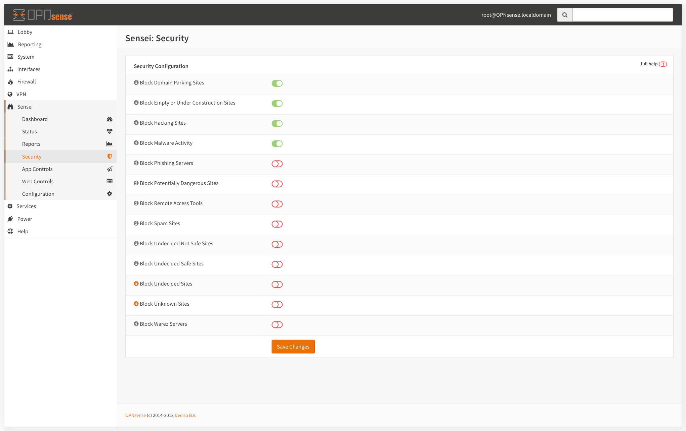

# Security

Sensei developed in a way to give all the controls to your hands. To achieve this, we did our best to make almost everything configurable. On the Security screen, you can set your general policy of how threat analysis will work and set the rest on the App Control and Web Control modules.


The engine process the request, queries "SVN Cloud" in realtime, and decides whether it will be blocked or allowed.  We check against 140+ Million Websites, under 120+ categories in milliseconds. 


The Cloud Threat Intelligence data is queried real time when anyone makes a connection through your network. This enables us to respond to malware and wireless outbreaks in real time and very fast.

