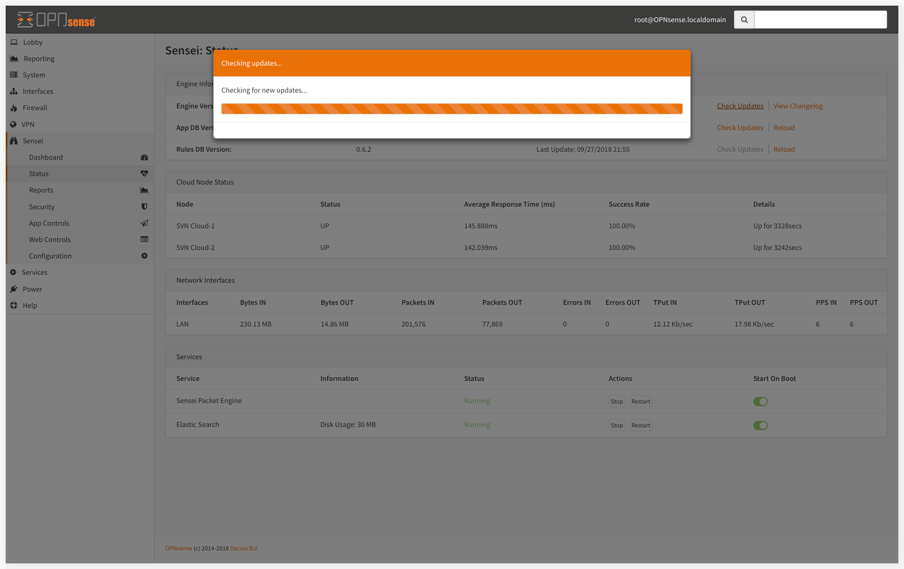

# Status

The Status screen provides all critical system level information you need to manage your Sensei as well as update tools.

## Engine Information

Here you find Engine, App DB, and Rules RB versions, their last update dates and the maintenance URLS.

###  Change Logs

### Engine Update

This link checks the latest stable minor version from Sensei update server and downloads the update and updates after your approval.

### App DB Update & Reload

"App DB" update link checks for the latest updates from Sensei update server and downloads the latest support version by your engine. After DB update, rules are re-loaded automatically. You can also force "App DB" to reload by clicking "reload" link here.

### Rules DB Update & Reload

"Rules DB" update link checks for the latest updates from Sensei update server and downloads the latest support version by your engine. After the database update, rules are re-loaded automatically. You can also force "Rules DB" to reload by clicking "reload" link here.

## Cloud Node Status

Web Categorization and The Cloud Threat Intelligence data is queried real time when anyone makes a connection through your network. It allows us to respond to malware and wireless outbreaks in real time and very fast.

You can see the SVN Cloud's response time and uptime on this table.

## Network Interfaces

This section displays all assigned interfaces set in during Initial Configuration Wizard or Configuration &gt; Interfaces section.

Overall network status, packets, throughput in & out can be seen here.

## Services

### Sensei Packet Engine

This section shows Sensei Packet Engine status and provides Start/Restart buttons for the engine as well as "Start on Boot" control to set the daemon status on a system restart.

### Elastic Search

Sensei uses Elastic Search as its database. This section shows the space used by Elastic Engine, Engine status and provides Start/Restart buttons for the engine as well as "Start on Boot" control to set the daemon status on a system restart.


We highly recommend keeping Elastic Search running all the time as it is the primary database for Sensei.


