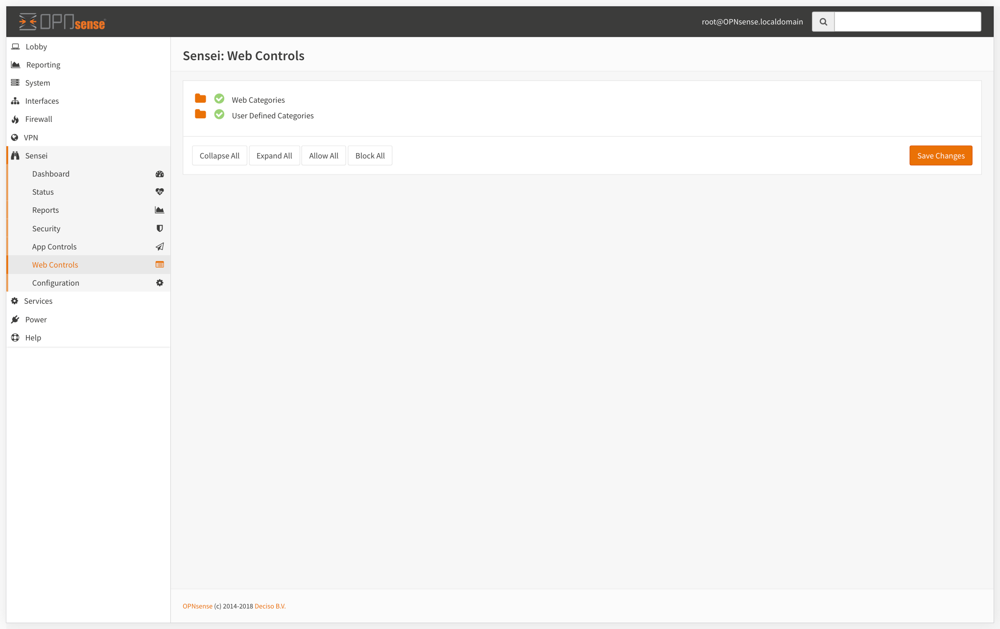
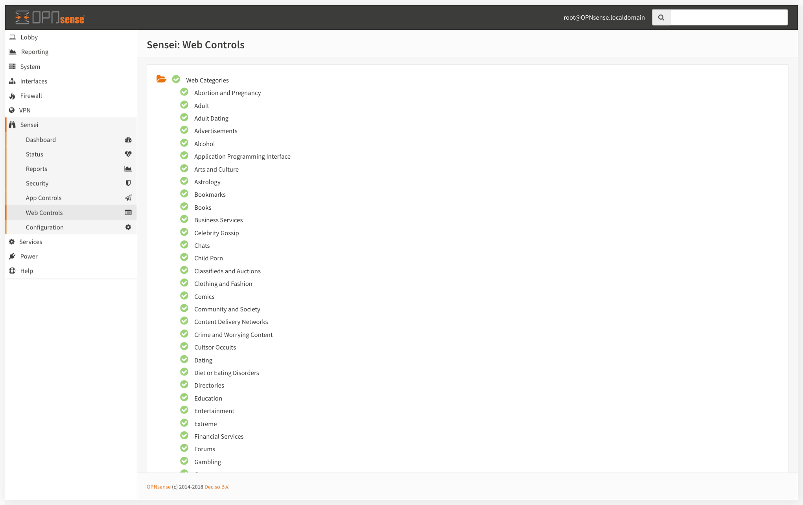
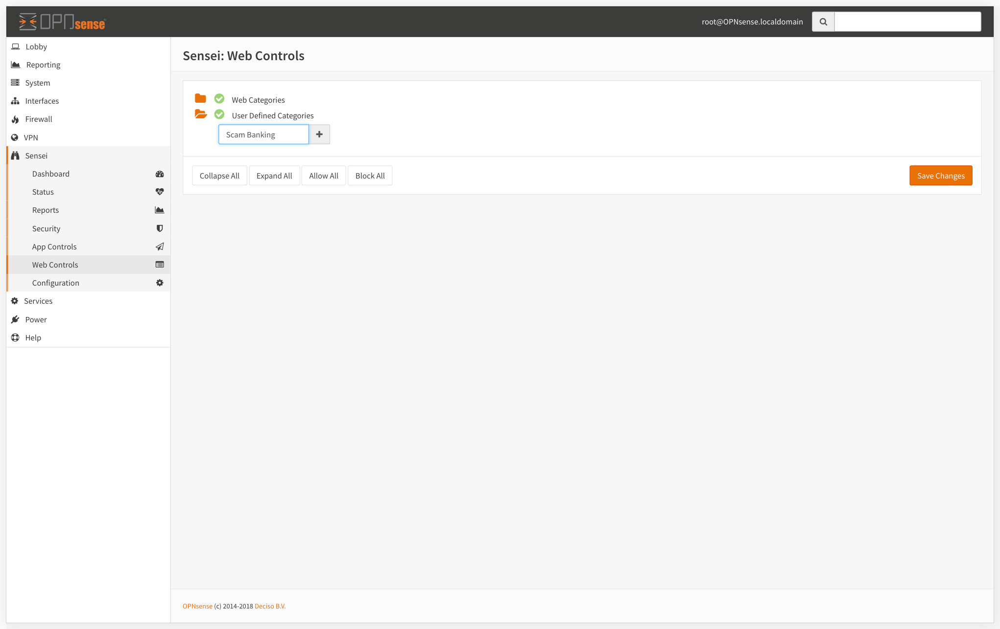
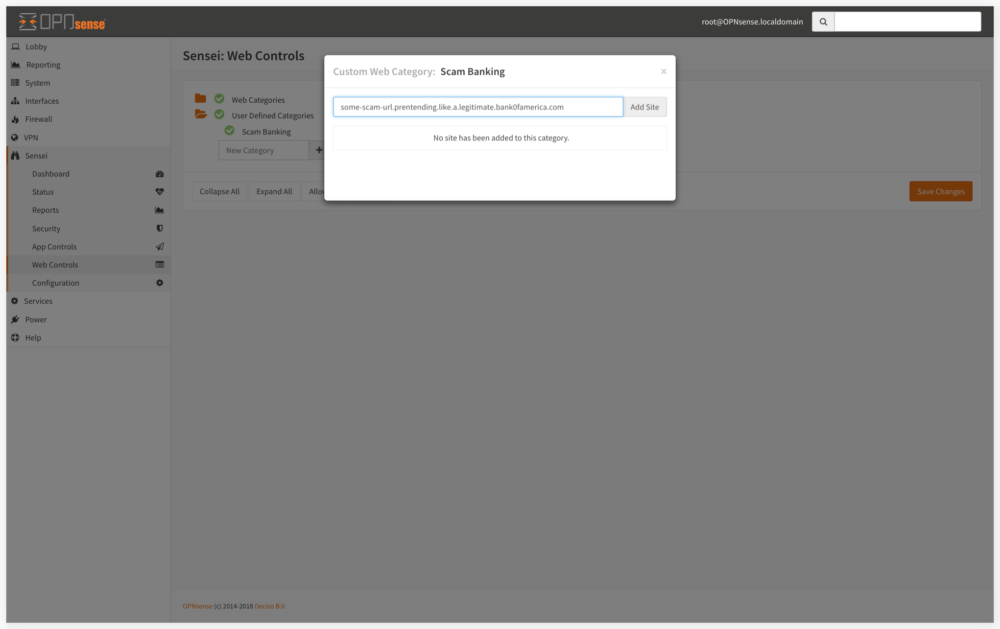
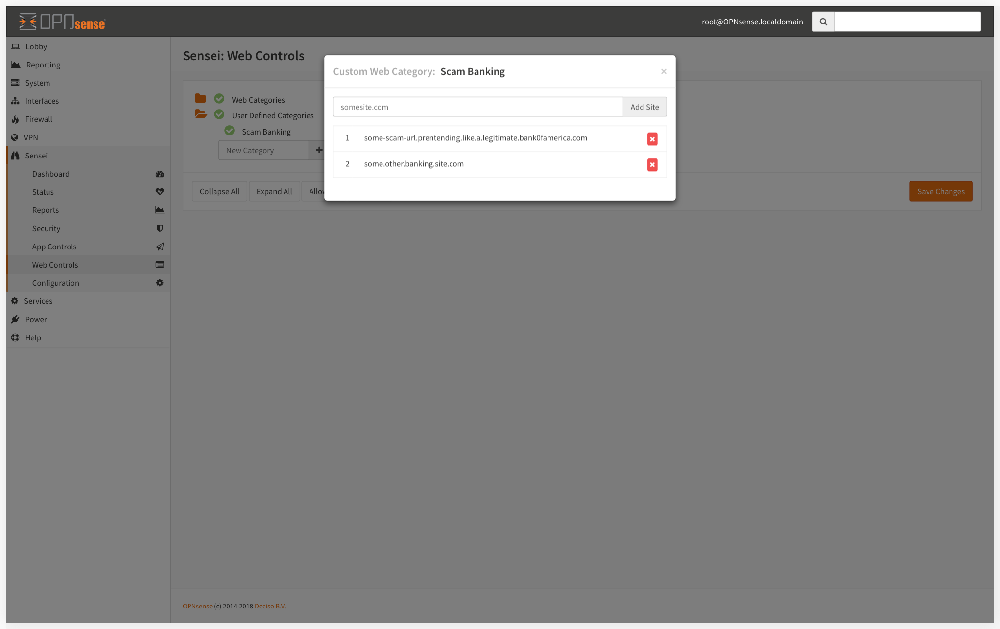
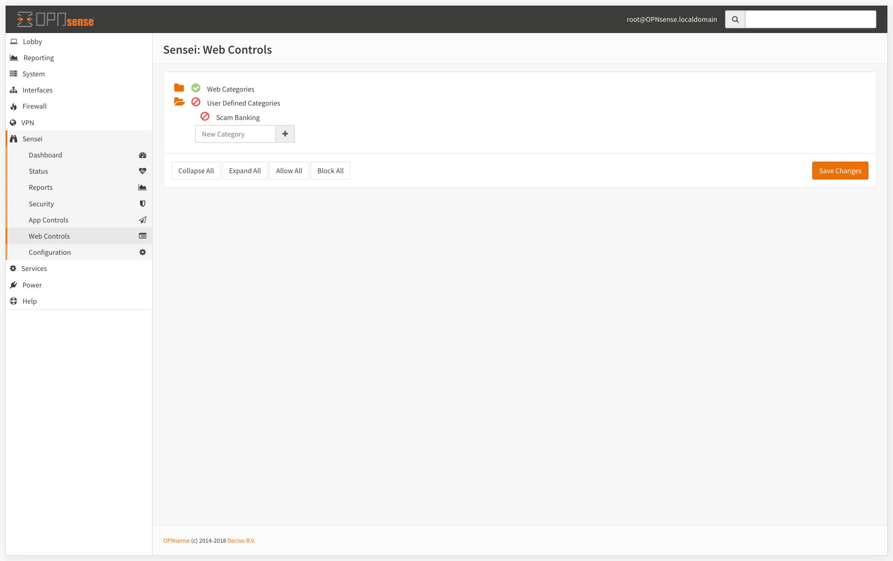

# Web Control

Sensei keeps an eye of web pages visited through your network, and does its job when someone hit an unwanted page silently. 

The engine process the request, queries "SVN Cloud" in realtime, and decides whether it will be blocked or allowed.  We check against 140+ Million Websites, under 120+ categories in milliseconds. 

## Categories

### Web Categories


"Web Categorization DB" is maintained by Sunny Valley Networks. You can check how fast we're working on [Status &gt; Cloud Node Status](status.md#cloud-node-status)


Web sites are categorized by their type, and listed in a click-to-open treeview for a convenient access. 

## User Defined Categories

Sensei's user oriented approach puts you to the center of the control universe. You can define your own web categories, add sites under them, and manage their status with just one click. 

### Adding a new user category 

* Click on the folder icon on the left side of the menu. This will popdown the tree and bring out the existing user defined categories if any.
* Enter the name for the new category.

### Adding a new site under the category

* Just after new category created, a new modal dialog asks for the very first site
* Enter your target site url and click on "Add Site" button 

* If you need, you can add as many as sites you want

* When you're done with adding new sites to the category, close the dialog.
* Click on the green check icon to the left to block your new added category
* Hit save to activate your new rules

### Editing a user defined category

* When you mouse over your user defined category, you'll get 2 new icons. 
* Edit `pencil` icon opens up the modal dialog to add new sites
* Delete `cross` icon deletes the whole category with all sites under it

## Blocking a Category

Sensei allows you to block individual categories by clicking on the green check icons located on the left side of each web category.

## Activating the rules

When you're ok with the changes you made, click on the button lower right corner of the screen to save and activate the rules.

